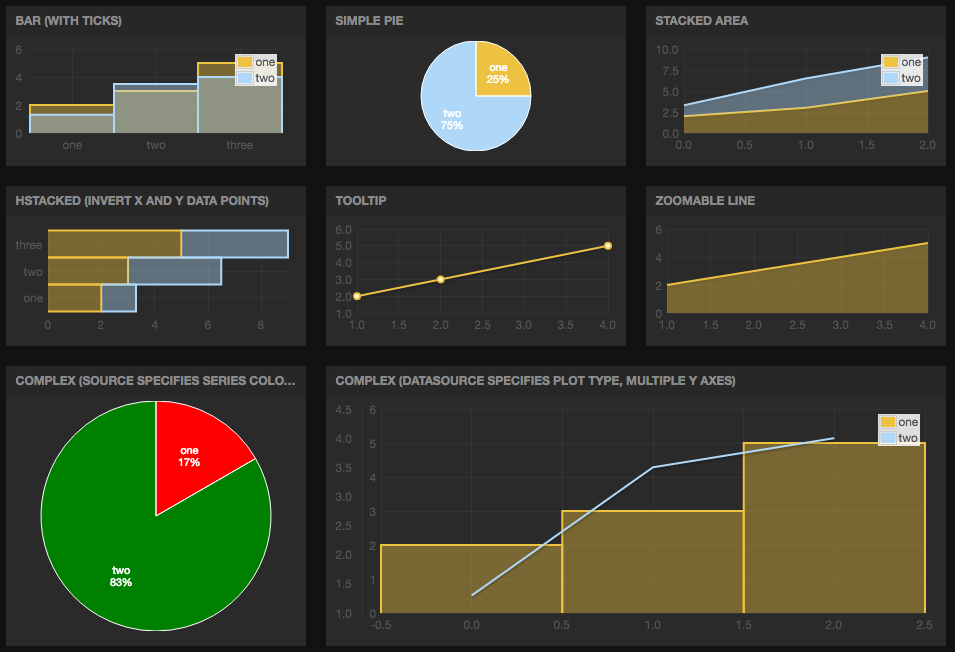

Freeboard Flot Extended Widget
==============================

This is a charting plugin for [Freeboard][fb] that uses [Flot][flot] to display
attractive charts. Derrived from [freeboard-flot][ffb], which worked on a FIFO system.
This version plots flot data structures directly, so can be used for historical data.
I've also cleaned up the code a little so it works correctly when widgets are resized,
as well as adding support for many different plot types, zooming, tool tips, custom
ticks, and various other stuff.

[fb]: https://github.com/Freeboard/freeboard
[flot]: http://www.flotcharts.org/
[ffb]: https://github.com/tecywiz121/freeboard-flot

## Installation

Drop `flot_extended.plugin.js` onto your web server, and add it to the list of
loaded plugins, after `freeboard.js`.

## Examples

Theres an examples.json which shows the various plot types and assocated data sources
